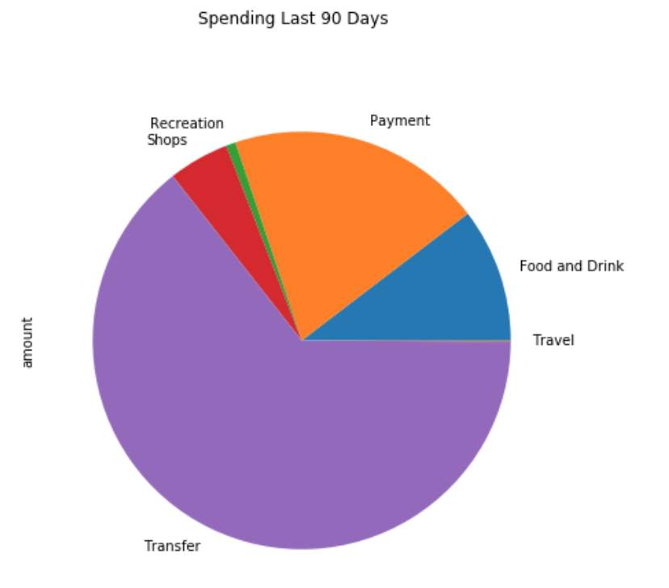
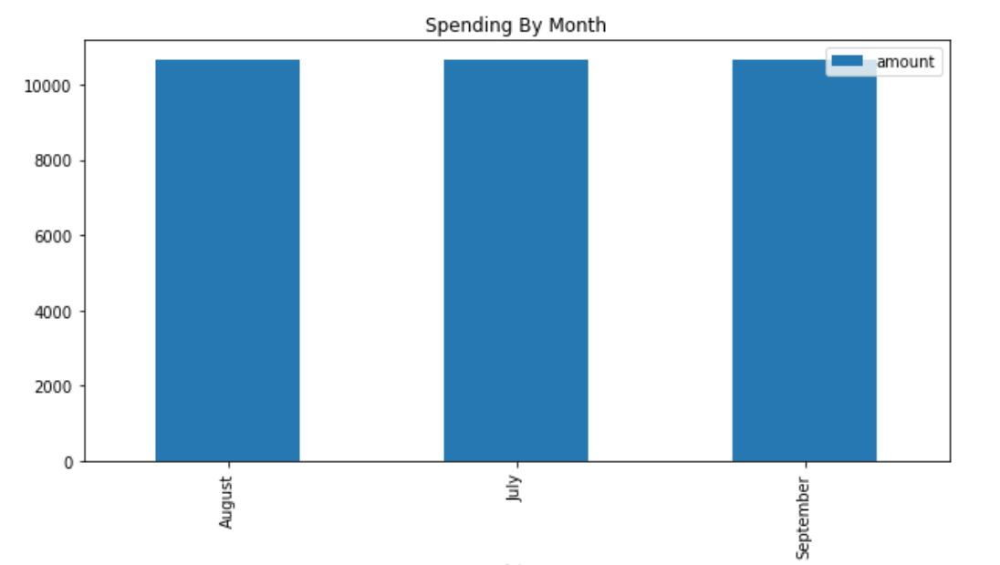
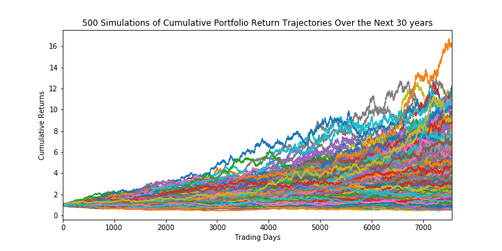
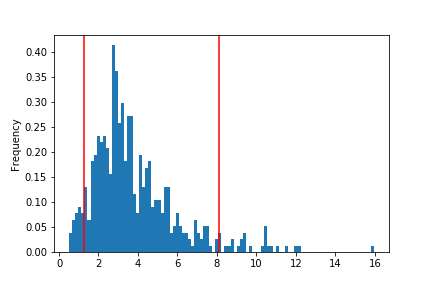
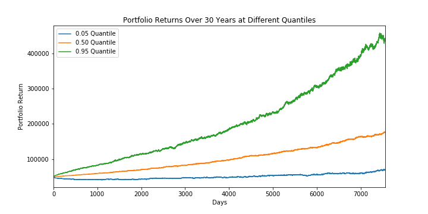
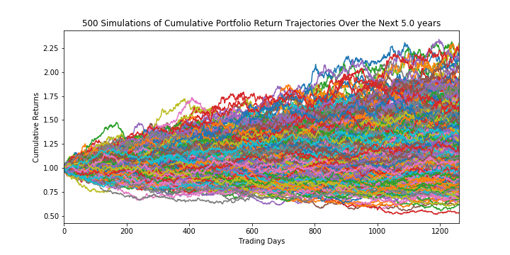
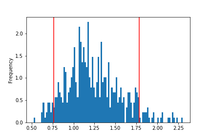
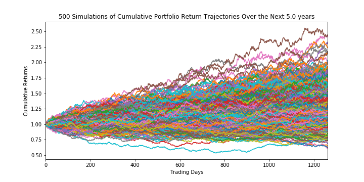
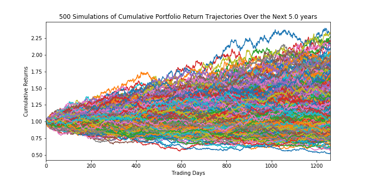
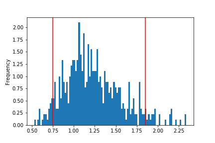

# Financial Report
In this report, we analyzed the personal finance data pulled from Plaid and historical security prices from IEX. With the data, we ran some analyses to link banking and investment accounts. In particular, this report aims to determine whether a portfolio could yield the income requirement of a customer. 

## Income Data
Looking at the income data, we find that the client has the following:

| Prev year's gross income | Current monthly income | Projected yearly income |
| :---: | :---: | :---: |
| 7,285 | 500 | 6,085 |

## Budget Analysis

We also looked at spending in the past 90 days and found:

| Spending Category | Amount |
| :---: | :---: |
| Food and Drink | 3,317.19 |
| Payment | 6,310.50 |
| Recreation | 235.50 |
| Shops | 1,500.00 |
| Transfer | 20,537.34 |
| Travel | 35.19 |

In this period, he spent 10,645.24 each month.

## Retirement Planning

Using a portfolio consisting of stocks and bonds, we built a retirement plan simulating historical data to project returns over time.

### Methodology
In running the simulation, we performed the following steps:
1. Take the historical closing prices of SPDR S&P 500 ETF (SPY) and iShares Core U.S. Aggregate Bond ETF (AGG) from the previous year.
2. Calculate average daily returns and volatility using standard deviation.
3. Assuming normal probability distribuition and taking into consideration average daily return and volatility, project portfolio cumulative returns from the last closing price and run 500 simulations over the 30 years (252 * 30 trading days), with portfolio weightage of 60% stocks ans 40% bonds.
4. Analyze results of simulations.

### Analysis

On the very last day, we find that the ending cumulative return is in the range of 0.5636- 17.2581.

Narrowing it to a 90% confidence interval, the portfolio could yield 1.3827 to 8.7909.

Calculating the return at 10th, 50th, and 90th percentiles and an initial investment of $50,000, we get:

| Percentile | Ending Cumulative Return | $ Portfolio Return |
| :---: | :---: | :---: |
| 10th | 1.8412 | 92,058.69
| 50th | 3.5160 | 175798.48
| 90th | 7.0410 | 352,050.91

Charting these percentile portfolio cumulative returns over the life of the investment, we get:

Now assuming a 4% withdrawal rate at retirement, we find that the 10th percentile retirement income of 3,682.35 is less than the projected income of 6,085.00, suggesting not enough confidence to determine whether the portfolio return could meet the annual income requirement.

If however, we increased the initial investmemt by 50%, we get find that the portfolio yields a 10th percentile retirement income of 8,285.28, greater than the projected income of 6,085. Given that 90% of expected returns will yield greater results, we can take comfort on the higher probability that the portfolio could meet the annual income requirement.

### Changing The Variables

Retiring earlier than 30 years could mean a shortened period for the portfolio to grow. Could tweaking the other variables to allow for a retirement in 5 years result in viable yields?

#### Higher risk

Increasing the stock to bond ratio to 70:30 and keeping initial investment at 50,000, we find:

| | |
| :--- | :--- |
| cumulative return range | 0.5211 - 2.2977 |
| 90% confidence interval | 0.7657 - 1.7832 |
| 10th %tile | return: 0.8429, dollar return: 42,145.56 |
| 50th %tile | return: 1.1818, dollar return: 59,091.87 |
| 90th %tile | return: 1.6930, dollar return 84,648.20 |
| retirement income @ 4% w/drawal rate | 1,685.82 |
| ret inc with 50% inc in initial investment | 2,528.73 |

With a riskier portfolio with 70:30 stocks to bonds ratio, we see lower yield across all analytics.

#### Higher initial investment

Investing more by 75% (87,500) and keeping 60:40 stocks to bond ratio, we get:

| | |
| :--- | :--- |
| cumulative return range | 0.61 - 2.44 |
| 90% confidence interval | 0.8564 - 1.8326 |
| 10th %tile | return: 0.9421, dollar return: 82,437.06 |
| 50th %tile | return: 1.2571, dollar return: 109,997.78 |
| 90th %tile | return: 1.7024, dollar return 148,958.47 |
| retirement income @ 4% w/drawal rate | 3,297.48 |
| ret inc with 50% inc in initial investment | 4,946.22 |

As expected, cumulative returns are lower. And even with a 75% increase in initial investment, 5 years of investing is not long enough to yield income enough to meet retirement requirement.

#### Higher risk and initial investment

Increasing the stock to bond ratio to 70:30 and initial investment by 75% (87,500), we find:

| | |
| :--- | :--- |
| cumulative return range | 0.5311 - 2.3359 |
| 90% confidence interval | 0.7495 - 1.8502 |
| 10th %tile | return: 0.8372, dollar return: 73,254.39 |
| 50th %tile | return: 1.1820, dollar return: 103,422.37 |
| 90th %tile | return: 1.7005, dollar return 148,792.88 |
| retirement income @ 4% w/drawal rate | 2,930.16 |
| ret inc with 50% inc in initial investment | 4,395.26 |

Even with both riskier profile and higher initial investment, the portfolio cannot confidently yield income enough to meet retirement requirements. Extending the analysis to longer than 5 years of investment is worth undertaking.

